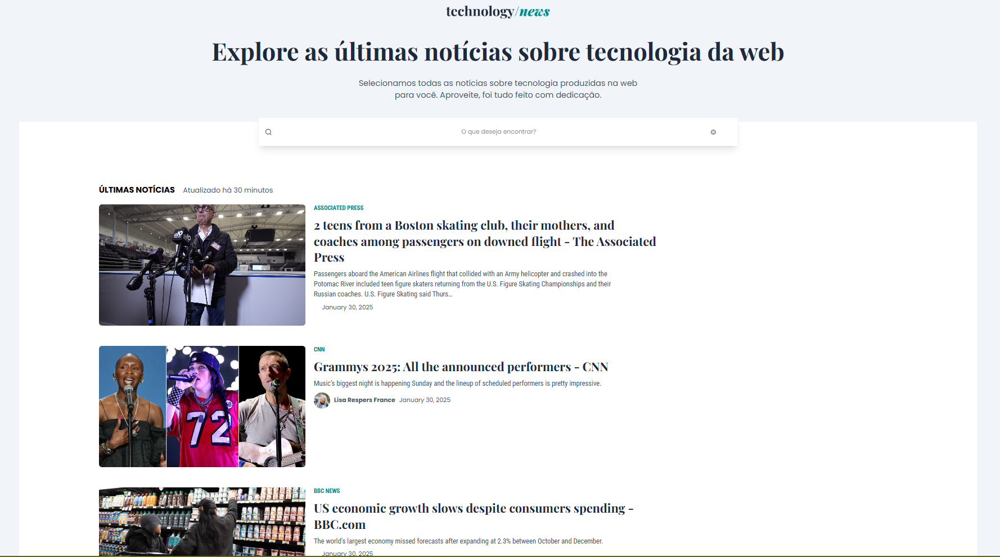
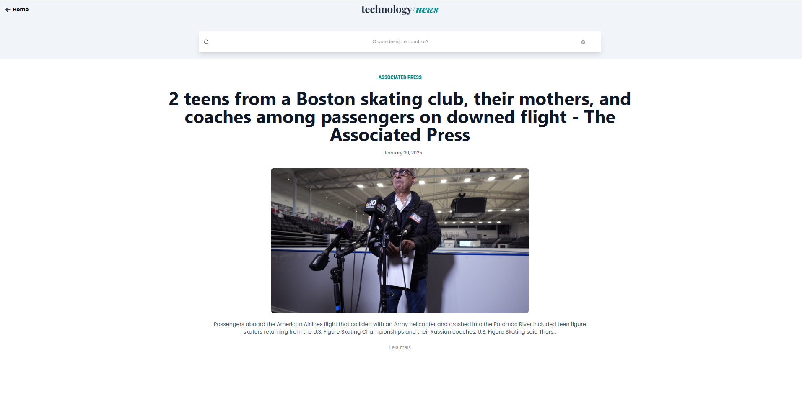

<h1 align="center">
  💻 News Technology
</h1>

  
  
 

  

  
   

 

## 📃 Sobre o projeto

Aplicação de notícias em que é possível buscar uma notícia e navegar entre elas utilizando a API do News API.

 

 

## 📚 Tecnologias utilizadas
-  React
-  Vite
- TaiwlindCSS
- Axios
- React Router DOM
- React Icons

   
  
## 🚀 Funcionalidades
  
### Requisitos Funcinais
- [x] Deve ser possível listar as notícias mais recentes em ordem cronológica;
- [x] Deve ser possível listar as notícias com `thumbnail`, `heading`, `description`, `author`, `image`, `category` e `source`;
- [x] Deve ser possível acessar a notícia pelo `slug`;
- [x] Deve ser possível o usuário buscar notícias desejada pelo `heading`;
- [x] Deve ser possível o usuário buscar notícia por `author`;
- [x] Deve ser possível o usuário ler uma notícia;
- [x] Deve ser possível salvar um `id` da notíca lida;
      
### Regras de negócio
- [x] O usuário não pode ler mais que 2 vezes a mesma notícia;
- [x] O usuário não pode ler uma notícia com o JavaScript desabilitado;
- [x] O usuário não pode ler uma notícia em modo anônimo;
- [x] O usuário não poderá acessar uma página de categoria;
- [x] O usuário não poderá acessar uma página de author;
- [ ] O usuário deverá ser redirecionado para página principal quando tentar acessar a página de categoria;
      
### Requisitos não-funcionais
- [x] Dynamic Routes: o `slug` da notícida deve ser: `/[category]/[heading]-[id]`
- [x] O `id` da notícia lida precisam estar persistidos em `localStorage`;
- [ ] O `id` da notícia persistida em `localStorage`, deve ser retornado quando passado o nome da chave `articles_read`;
- [x] A lista de notícias deve estar paginadas com 20 itens por página;
- [x] A lista de notícias deve exibir as últimas notícias em ordem cronológica;
- [x] O usuário com JavaScript desabilitado no Browser deverá ser direcionado para page-block;
- [x] O usuário em aba anônimo no Browser deverá ser direcionado para page-block;
- [x] O usuário com mais de 10 leituras diferentes deverá ser direcionado para page-block;

## 🛠 Instalação 
1. Clone o repositório:
2. Abra o terminal e execute o seguinte comando para clonar o repositório: `git clone https://github.com/anapaulasanto/technology-news.git`
2. Navegue até o diretório do projeto: `cd project`
3. Instale as dependências:`npm install`
4. Inicie o projeto: `npm run dev`

<h2> 💻 Autor</h2>

 
  
 <b>Ana Paula</b>

Feito por Ana paula 👋🏽 
